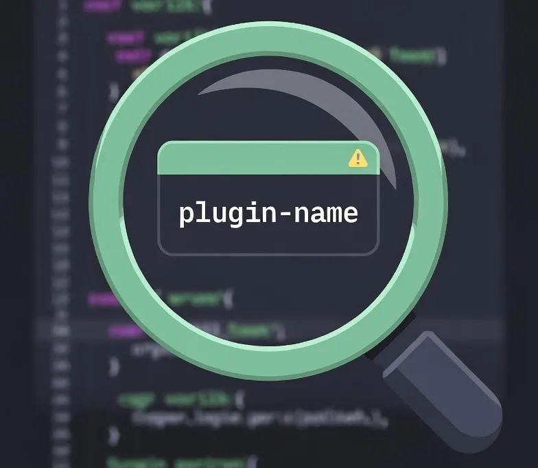

# who-called.nvim

[](https://opensource.org/licenses/MIT)
[](https://neovim.io)

A Neovim debugging plugin that identifies which plugin is responsible for UI elements like notifications, floating windows, and diagnostics.

<p align="center">
  
</p>

## Features

- **Notification Tracking**: Automatically prepends `[plugin-name]` to `vim.notify` messages
- **Floating Window Tracking**: Records which plugin creates floating windows
- **Diagnostic Tracking**: Shows diagnostic source information
- **Buffer Tracking**: Identifies plugins that create or modify buffers
- **Option Tracking**: Detects which plugin sets options like `winbar`
- **Live Inspector**: Real-time floating window that shows plugin info for current buffer
- **Hover Mode**: Mouse hover tooltips showing plugin information for UI elements
- **History Viewer**: Browse all tracked events with `:WhoCalledHistory`

## Requirements

- Neovim >= 0.9.0
- [lazy.nvim](https://github.com/folke/lazy.nvim) (required for plugin name resolution)

## Installation

### [lazy.nvim](https://github.com/folke/lazy.nvim)

```lua
{
  "shabaraba/who-called.nvim",
  cmd = { "WhoCalled", "WhoCalledInspect", "WhoCalledHistory" },
  keys = {
    { "<leader>wc", "<cmd>WhoCalled<cr>", desc = "Toggle who-called" },
    { "<leader>wi", "<cmd>WhoCalledInspect<cr>", desc = "Inspect current window" },
  },
  opts = {},
}
```

### [packer.nvim](https://github.com/wbthomason/packer.nvim)

```lua
use {
  "shabaraba/who-called.nvim",
  config = function()
    require("who-called").setup()
  end,
}
```

### [vim-plug](https://github.com/junegunn/vim-plug)

```vim
Plug 'shabaraba/who-called.nvim'

" In your init.vim or init.lua
lua require("who-called").setup()
```

## Configuration

```lua
require("who-called").setup({
  -- Start with tracking disabled (enable with :WhoCalled)
  enabled = false,

  -- Maximum number of tracked events in history
  history_limit = 100,

  -- Prepend [plugin-name] to vim.notify messages
  show_in_notify = true,

  -- Enable/disable specific tracking features
  track_notify = true,
  track_windows = true,
  track_diagnostics = true,
  track_buffers = true,

  -- Auto-start these features on setup
  hover = false,
  live_inspector = false,
})
```

## Commands

| Command | Description |
|---------|-------------|
| `:WhoCalled` | Toggle all features (tracking + live inspector + hover) |
| `:WhoCalledInspect` | One-time inspection of current window/buffer |
| `:WhoCalledHistory` | Show history of all tracked events |
| `:WhoCalledClear` | Clear the event history |

## Usage

### Basic Debugging

1. Run `:WhoCalled` to enable tracking
2. Use your editor normally - notifications will show `[plugin-name]` prefix
3. A live inspector window appears in the corner showing current buffer info
4. Hover your mouse over UI elements to see which plugin created them
5. Run `:WhoCalled` again to disable

### Quick Inspection

If you just want to check the current window without enabling full tracking:

```vim
:WhoCalledInspect
```

This opens a floating window showing:
- Buffer information (name, filetype, buftype)
- Window information (normal or floating)
- Winbar plugin detection
- Sign column plugins
- Statusline/tabline plugins

### Keybinding Examples

```lua
-- In your lazy.nvim config
keys = {
  { "<leader>wc", "<cmd>WhoCalled<cr>", desc = "Toggle who-called" },
  { "<leader>wi", "<cmd>WhoCalledInspect<cr>", desc = "Inspect current window" },
  { "<leader>wh", "<cmd>WhoCalledHistory<cr>", desc = "Show history" },
},
```

## How It Works

1. **Stack Trace Analysis**: Uses `debug.getinfo()` to walk the call stack when events occur
2. **lazy.nvim Integration**: Maps file paths to plugin names using lazy.nvim's plugin directory (`~/.local/share/nvim/lazy/`)
3. **Utility Plugin Filtering**: Skips intermediate plugins (plenary.nvim, nui.nvim, nvim-notify) to find the actual caller
4. **Event History**: Maintains a circular buffer of tracked events for later review

### Tracked Variables

The plugin sets these variables for tracking:
- `vim.w.who_called_plugin` - Plugin that created the window
- `vim.b.who_called_plugin` - Plugin that created/modified the buffer
- `vim.w.who_called_winbar` - Plugin that set the winbar

## Limitations

- **lazy.nvim Required**: Plugin resolution only works with lazy.nvim managed plugins
- **Timing Dependent**: Events that occur before who-called is enabled won't be tracked
- **Vim Commands**: Plugins using `:edit`, `:split` etc. may not be tracked (only `nvim_create_buf` and `nvim_open_win` are hooked)

## Performance

- Tracking is disabled by default to avoid runtime overhead
- Enable only when debugging specific issues
- Stack trace collection occurs on every tracked event when enabled
- History is capped to prevent memory growth

## License

MIT

## Related Projects

- [nvim-notify](https://github.com/rcarriga/nvim-notify) - Notification manager
- [noice.nvim](https://github.com/folke/noice.nvim) - UI replacement
